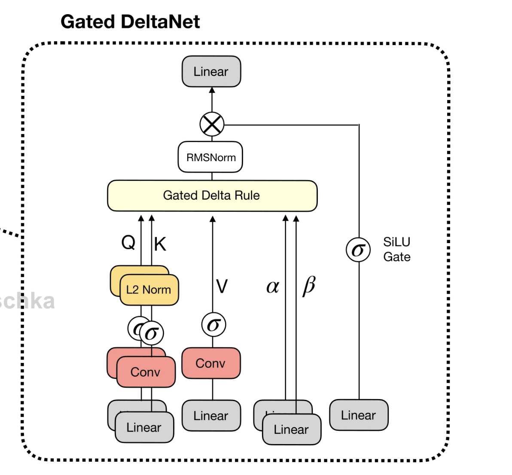

TODO: Readme
explains gqa, mqa, and mha as limiting cases of gqa
also include explanation of root dk scaling based on input variance;
How does QK-normalisation promote nore stability in attention?
How does Positional embedding reduce the induction bias in transformers?
uses safe and normal softmax

NEXTSTEPS:
1. sliding window attention tweaks on top of GQA and testing performance
2. also add the backprop for the attention module

